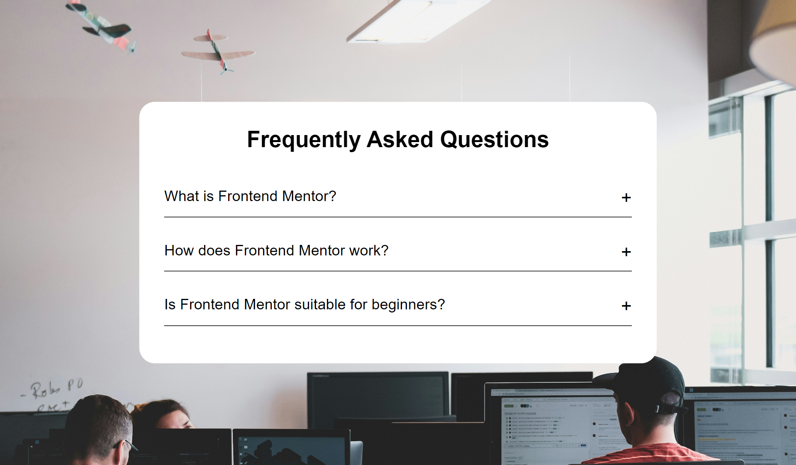
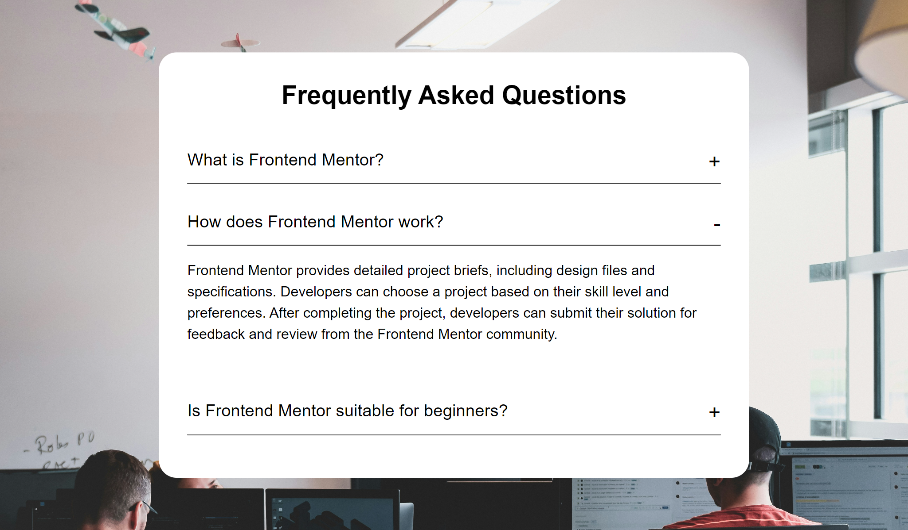
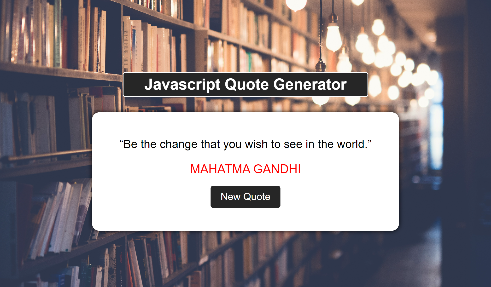
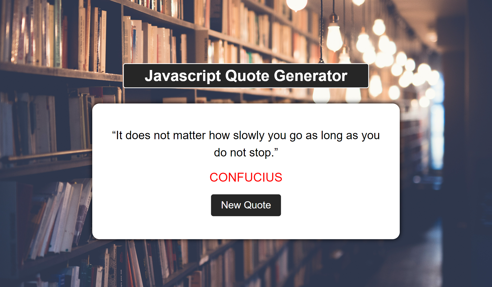
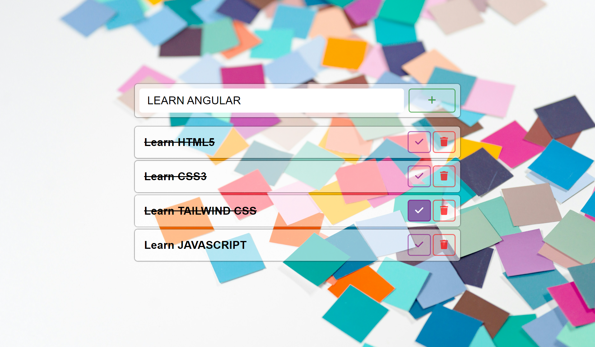

# Javascript Projects

Welcome to my collection of JavaScript projects!

These projects showcase my journey with HTML, CSS, and Vanilla JavaScript, covering various essential concepts.

## Table of Contents

- [Javascript Projects](#javascript-projects)
  - [Table of Contents](#table-of-contents)
  - [Find the Model](#find-the-model)
  - [Frequently Asked Questions](#frequently-asked-questions)
  - [JavaScript Quote Generator](#javascript-quote-generator)
  - [Stopwatch](#stopwatch)
  - [ToDo List](#todo-list)
  - [Technologies Used](#technologies-used)
  - [Author](#author)

## Find the Model

Explore an interactive layout where users can unveil hidden content by triggering specific actions.

|  |  |
| :-----------------------------------------------------: | :-----------------------------------------------------: |

## Frequently Asked Questions

Dive into a curated collection of frequently asked questions about Frontend Mentor, providing insights and coordination for frontend development enthusiasts.

|  |  |
| :-----------------------------------------------------------------------------: | :-----------------------------------------------------------------------------: |

## JavaScript Quote Generator

Experience a simple yet elegant quote generator. Displaying thoughtful quotes and their authors, the generator allows users to refresh their inspiration with just a click.

|  |  |
| :-----------------------------------------------------------------------------: | :-----------------------------------------------------------------------------: |

## Stopwatch

Utilize a sleek and functional stopwatch with start and reset buttons, complemented by a responsive stop button for optimal time management.

|  |  |  |
| :-------------------------------------------: | :-------------------------------------------: | :-------------------------------------------: |

## ToDo List

Efficiently manage your tasks with this ToDo list application. Users can easily save, mark as complete, and delete tasks as needed.

|  |  |
| :---------------------------------: | :---------------------------------: |

## Technologies Used

- Semantic HTML5 markup
- CSS custom properties
- Javascript

## Author

- Frontend Mentor - [@wess-MHHW](https://www.frontendmentor.io/profile/wess-MHHW)
- LeetCode - [@wess-MHHW](https://leetcode.com/wess-MHHW/)
- Linkedin - [@wassim-maaoui](https://www.linkedin.com/in/wassim-maaoui/)
