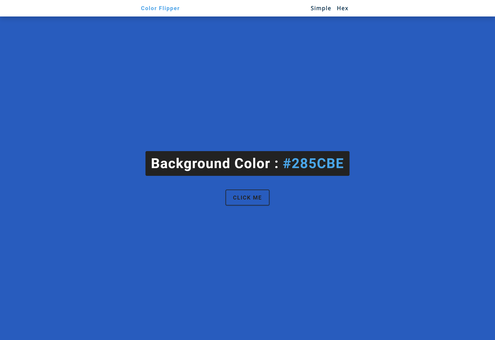

# Javascript Projects

Welcome to my collection of JavaScript projects!

These projects showcase my journey with HTML, CSS, and Vanilla JavaScript, covering various essential concepts.

## Table of Contents

- [Javascript Projects](#javascript-projects)
  - [Table of Contents](#table-of-contents)
  - [Find the Model](#find-the-model)
  - [Frequently Asked Questions](#frequently-asked-questions)
  - [JavaScript Quote Generator](#javascript-quote-generator)
  - [Stopwatch](#stopwatch)
  - [ToDo List](#todo-list)
  - [Color Flipper](#color-flipper)
  - [Countdown timer](#countdown-timer)
  - [Counter](#counter)
  - [Grocery bud](#grocery-bud)
  - [Lorem Ipsum](#lorem-ipsum)
  - [menu](#menu)
  - [Modal](#modal)
  - [Navbar](#navbar)
  - [Questions](#questions)
  - [Reviews](#reviews)
  - [Scroll](#scroll)
  - [Sidebar](#sidebar)
  - [Slider](#slider)
  - [Tabs](#tabs)
  - [Video](#video)
  - [Technologies Used](#technologies-used)
  - [Author](#author)

## Find the Model

Explore an interactive layout where users can unveil hidden content by triggering specific actions.

|  |  |
| :-----------------------------------------------------: | :-----------------------------------------------------: |

## Frequently Asked Questions

Dive into a curated collection of frequently asked questions about Frontend Mentor, providing insights and coordination for frontend development enthusiasts.

|  |  |
| :-----------------------------------------------------------------------------: | :-----------------------------------------------------------------------------: |

## JavaScript Quote Generator

Experience a simple yet elegant quote generator. Displaying thoughtful quotes and their authors, the generator allows users to refresh their inspiration with just a click.

|  |  |
| :-----------------------------------------------------------------------------: | :-----------------------------------------------------------------------------: |

## Stopwatch

Utilize a sleek and functional stopwatch with start and reset buttons, complemented by a responsive stop button for optimal time management.

|  |  |  |
| :-------------------------------------------: | :-------------------------------------------: | :-------------------------------------------: |

## ToDo List

Efficiently manage your tasks with this ToDo list application. Users can easily save, mark as complete, and delete tasks as needed.

|  |  |
| :---------------------------------: | :---------------------------------: |

## Color Flipper

Allows users to randomly change the background color using simple color names or hexadecimal codes, displaying the actual value.

|  |  |
| :-------------------------------------------: | :-------------------------------------------: |

## Countdown timer

Display a winning gift competition alongside its deadline with a countdown timer.

|  |  |
| :-------------------------------------------: | :-------------------------------------------: |

## Counter

Interactive counter that enables users to increase, decrease by 1, or reset to 0.

|  |  |  |
| :-------------------------------------------: | :-------------------------------------------: | :-------------------------------------------: |

## Grocery bud

Create, edit, and delete items in a grocery list.

|  |  |  |
| :-------------------------------------------: | :-------------------------------------------: | :-------------------------------------------: |

## Lorem Ipsum

Generate a customizable number of Lorem Ipsum paragraphs.

|  |  |
| :-------------------------------------------: | :-------------------------------------------: |

## menu

Display a categorized list of foods with filter options.

| 

## Modal

Interact with the interface by displaying specific content upon clicking a button.

|  |  |
| :-------------------------------------------: | :-------------------------------------------: |

## Navbar

Ensure smooth navigation and representation of the navbar on smaller screens.

|  |  |
| :-------------------------------------------: | :-------------------------------------------: |

## Questions

Toggle between hiding and displaying answers to given questions.

|  |  |
| :-------------------------------------------: | :-------------------------------------------: |

## Reviews

Browse a list of reviews with options to view the next, previous, or a random review.

| 

## Scroll

Enable smooth scrolling between page sections.

| 

## Sidebar

Toggle the display of the sidebar.

|  |  |
| :-------------------------------------------: | :-------------------------------------------: |

## Slider

Navigate through a carousel of photos.

|  |  |  |
| :-------------------------------------------: | :-------------------------------------------: | :-------------------------------------------: |

## Tabs

Access additional information through dedicated buttons.

|  |  |
| :-------------------------------------------: | :-------------------------------------------: |

## Video

Play, stop, and view loading status of a video.

|  |  |  |
| :-------------------------------------------: | :-------------------------------------------: | :-------------------------------------------: |

## Technologies Used

- Semantic HTML5 markup
- CSS custom properties
- Javascript

## Author

- Frontend Mentor - [@wess-MHHW](https://www.frontendmentor.io/profile/wess-MHHW)
- LeetCode - [@wess-MHHW](https://leetcode.com/wess-MHHW/)
- Linkedin - [@wassim-maaoui](https://www.linkedin.com/in/wassim-maaoui/)
